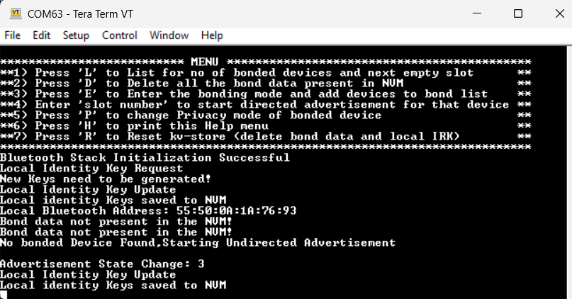
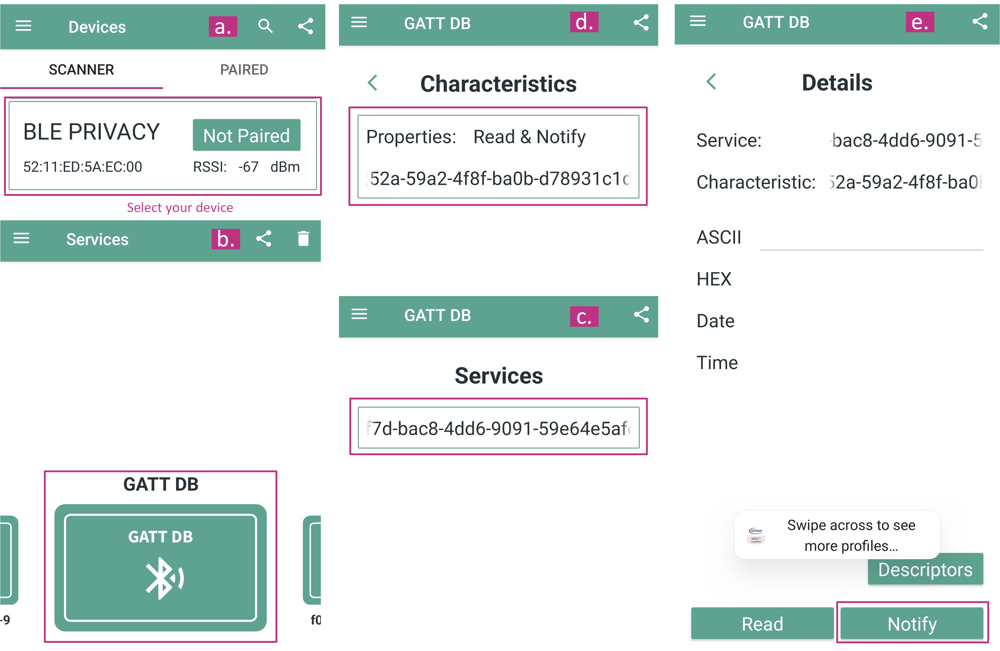
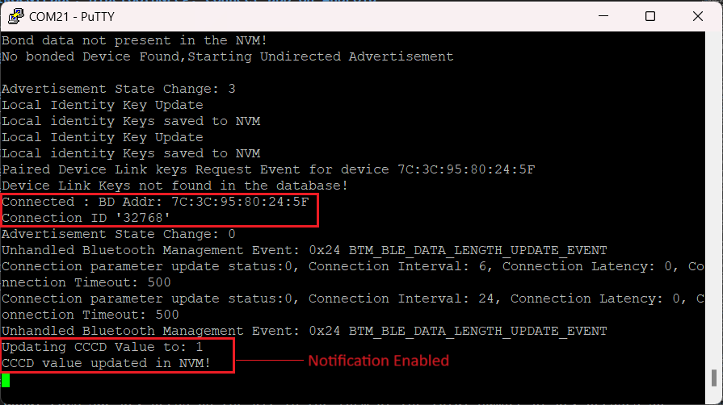
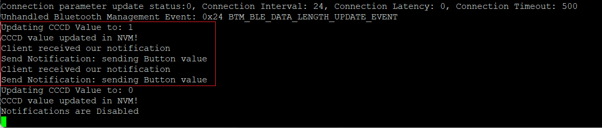
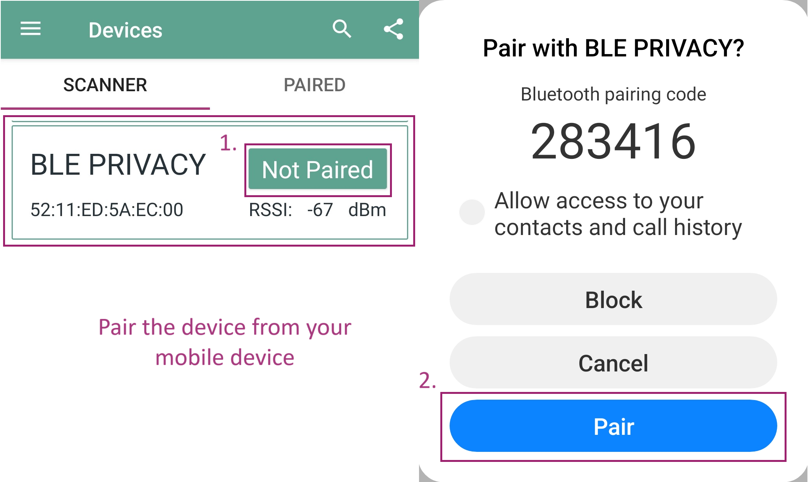
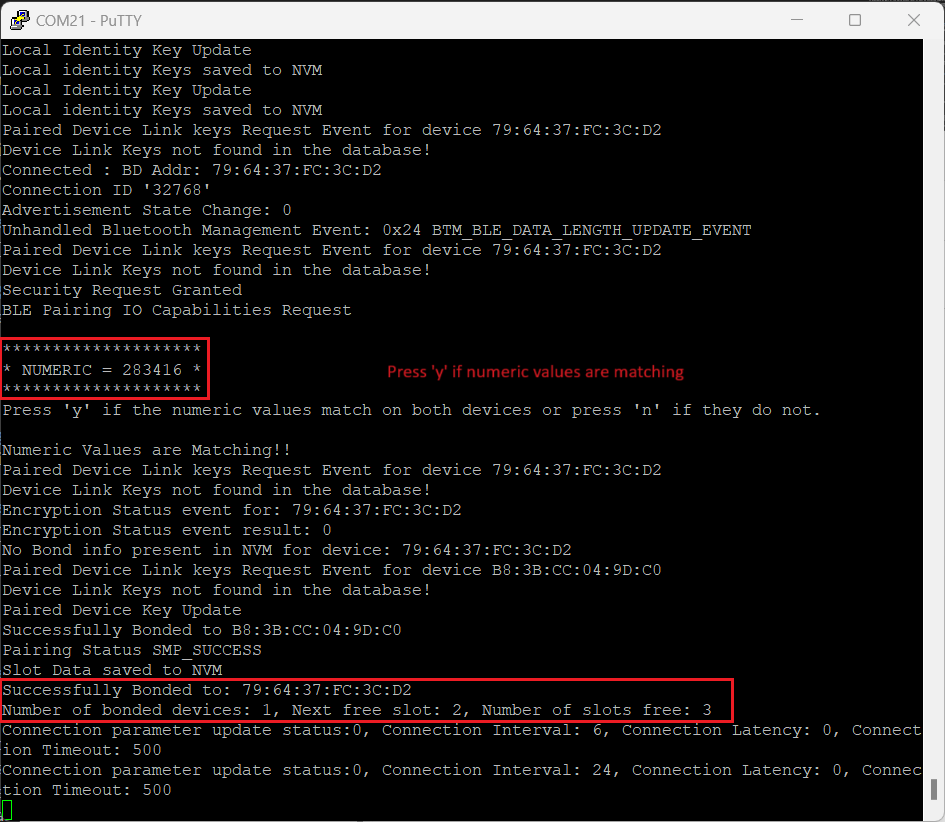
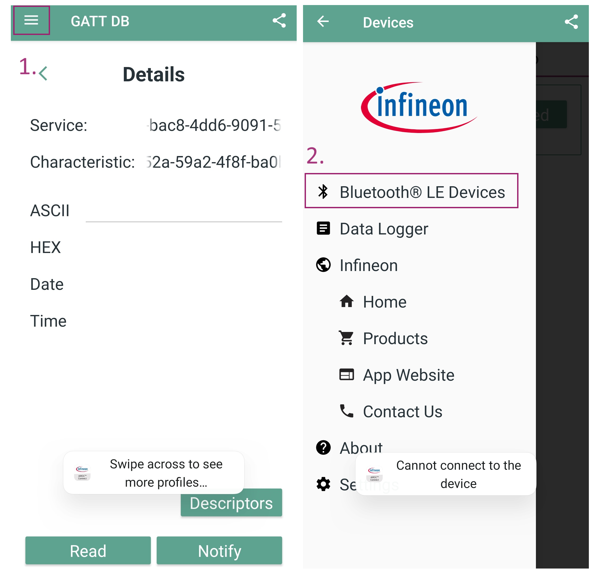
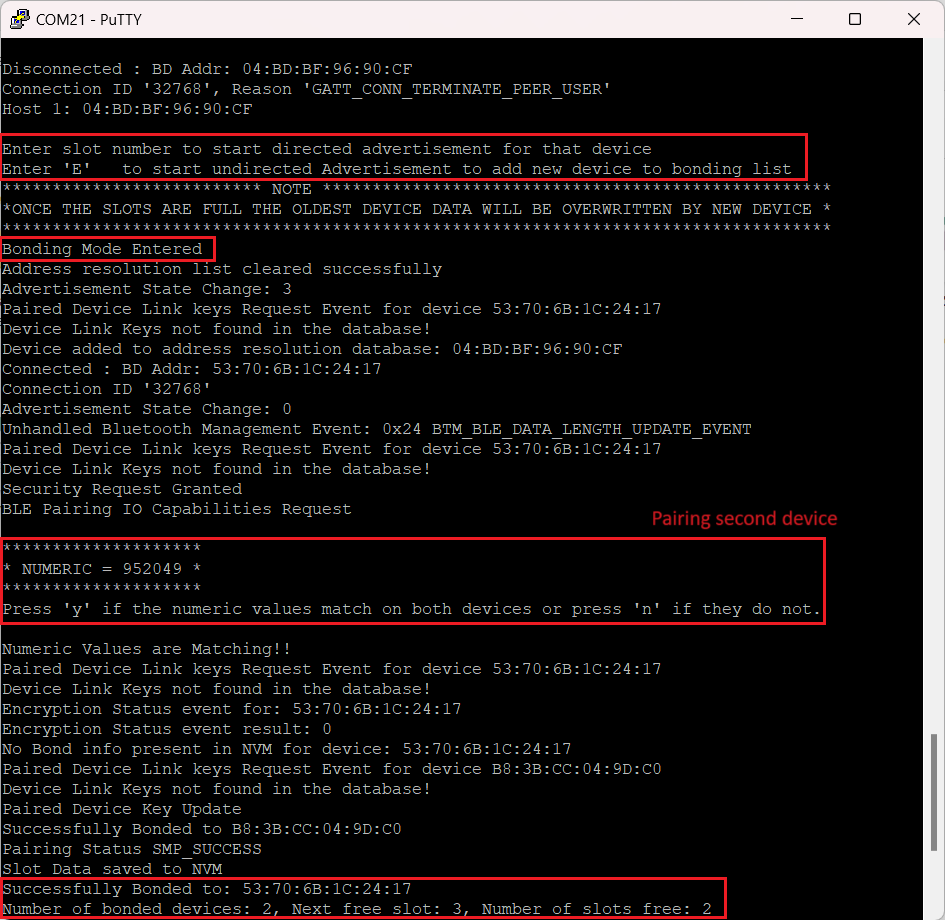

# PSOC&trade; Edge MCU: Bluetooth&reg; LE peripheral privacy

This code example demonstrates the privacy features available to you in Bluetooth&reg; 5.0 and above using PSOC&trade; Edge MCU coupled with AIROC&trade; CYW55513 Wi-Fi & Bluetooth&reg; combo chip in the ModusToolbox&trade; software environment.

Features demonstrated:
- Privacy modes as defined in Bluetooth&reg; spec 5.0 and later
- Use of persistent storage for bond data management
- Management and handling of bond data of multiple peer devices

This code example has a three project structure: CM33 secure, CM33 non-secure, and CM55 projects. All three projects are programmed to the external QSPI flash and executed in Execute in Place (XIP) mode. Extended boot launches the CM33 secure project from a fixed location in the external flash, which then configures the protection settings and launches the CM33 non-secure application. Additionally, CM33 non-secure application enables CM55 CPU and launches the CM55 application.
> **Note:** On the KIT_PSE84_HMI, all three projects are programmed to the external OSPI flash instead of QSPI.

[View this README on GitHub.](https://github.com/Infineon/mtb-example-psoc-edge-btstack-peripheral-privacy)

[Provide feedback on this code example.](https://yourvoice.infineon.com/jfe/form/SV_1NTns53sK2yiljn?Q_EED=eyJVbmlxdWUgRG9jIElkIjoiQ0UyNDE5MDAiLCJTcGVjIE51bWJlciI6IjAwMi00MTkwMCIsIkRvYyBUaXRsZSI6IlBTT0MmdHJhZGU7IEVkZ2UgTUNVOiBCbHVldG9vdGgmcmVnOyBMRSBwZXJpcGhlcmFsIHByaXZhY3kiLCJyaWQiOiJhcnZpbmRrdW1hci5zdXJlc2hrdW1hckBpbmZpbmVvbi5jb20iLCJEb2MgdmVyc2lvbiI6IjIuMi4wIiwiRG9jIExhbmd1YWdlIjoiRW5nbGlzaCIsIkRvYyBEaXZpc2lvbiI6Ik1DRCIsIkRvYyBCVSI6IklDVyIsIkRvYyBGYW1pbHkiOiJQU09DIn0=)

See the [Design and implementation](docs/design_and_implementation.md) for the functional description of this code example.

## Requirements

- [ModusToolbox&trade;](https://www.infineon.com/modustoolbox) v3.7 or later (tested with v3.9)
- Board support package (BSP) minimum required version: 1.4.0
- Programming language: C
- Associated parts: All [PSOC&trade; Edge MCU](https://www.infineon.com/products/microcontroller/32-bit-psoc-arm-cortex/32-bit-psoc-edge-arm) parts

## Supported toolchains (make variable 'TOOLCHAIN')

- GNU Arm&reg; Embedded Compiler v14.2.1 (`GCC_ARM`) – Default value of `TOOLCHAIN`
- Arm&reg; Compiler v6.22 (`ARM`)
- IAR C/C++ Compiler v9.70.4 (`IAR`)
- LLVM Embedded Toolchain for Arm&reg; v19.1.5 (`LLVM_ARM`)

## Supported kits (make variable 'TARGET')

- [PSOC&trade; Edge E84 Evaluation Kit](https://www.infineon.com/KIT_PSE84_EVAL) (`KIT_PSE84_EVAL_EPC2`) – Default value of `TARGET`
- [PSOC&trade; Edge E84 Evaluation Kit](https://www.infineon.com/KIT_PSE84_EVAL) (`KIT_PSE84_EVAL_EPC4`)
- [PSOC&trade; Edge E84 HMI Kit](https://www.infineon.com/KIT_PSE84_HMI) (`KIT_PSE84_HMI`)

## Hardware setup

This example uses the board's default configuration. See the kit user guide to ensure that the board is configured correctly.

Ensure the following jumper and pin configuration on board.
- BOOT SW must be in the HIGH/ON position
- J20 and J21 must be in the tristate/not connected (NC) position for the PSOC&trade; Edge E84 Evaluation Kit

## Software setup

See the [ModusToolbox&trade; tools package installation guide](https://www.infineon.com/ModusToolboxInstallguide) for information about installing and configuring the tools package.

Install a terminal emulator if you do not have one. Instructions in this document use [Tera Term](https://teratermproject.github.io/index-en.html).

Download and install the AIROC&trade; Bluetooth&reg; Connect App on your [Android](https://play.google.com/store/apps/details?id=com.infineon.airocbluetoothconnect) phone.

Scan the following QR code from your mobile phone to download the AIROC&trade; Bluetooth&reg; Connect App.

This example requires no additional software or tools.

## Operation

See [Using the code example](docs/using_the_code_example.md) for instructions on creating a project, opening it in various supported IDEs, and performing tasks, such as building, programming, and debugging the application within the respective IDEs.

1. Connect the board to your PC using the provided USB cable through the KitProg3 USB connector

2. Open a terminal program and select the KitProg3 COM port. Set the serial port parameters to 8N1 and 115200 baud

3. After programming, the application starts automatically. Confirm that the following output is displayed on the UART terminal

   **Figure 1. Terminal output at the start of the application**
    
   

4. From the AIROC&trade; Bluetooth&reg; Connect App:

   a. Tap on the device that you wish to connect with (here, `BLE PRIVACY`)

   b. Select GATT DB to see the available services

   c. Select a service

   d. Select a characteristic

   e. Enable notifications

   **Figure 2** shows how to connect device and enable notifications

   **Figure 2. AIROC&trade; Bluetooth&reg; Connect App on Android**

   

   **Figure 3** shows the terminal output that confirms a successful connection and enabled notifications

   **Figure 3. Terminal output showing connection**
    
   

5. Press the **User Button1 (SW2)** on the kit: The application will receive notifications about each SW2 key press on the kit, indicating the cumulative number of key presses. The terminal will confirm whether the client has received the notifications, as shown in **Figure 4**

   **Figure 4. Terminal output showing notification**
    
   

   The application runs a custom button service with one custom characteristic that counts the number of button presses on the kit. It can be read or setup for notifications. Each time the button press on the kit, the count value is incremented. If any device is connected and has notifications enabled, the updated value is sent to it. A message informing the same is displayed if no device is connected or notifications are disabled

   > **Note:** The button count is incremented on the button press, irrespective of whether any device is connected or not

6. To store the bonding information, pair the Bluetooth&reg; LE devices with the PSOC&trade; device (here, `BLE PRIVACY`). The system has four available slots, each can store bonding information for one Bluetooth&reg; LE device, as shown in **Figure 5**

   **Figure 5. Device snippet showing pairing on mobile Bluetooth&reg; LE device**

   

   In the Terminal window, enter **y** if the numeric values displayed match on both devices, to successfully bond the device, as shown in **Figure 6**

   **Figure 6. Terminal output during the pairing process**
    
   

   After the device is paired, repeat the procedures from steps 5 and 6 to launch the application and verify its proper function

7. To connect with another mobile device, disconnect your current device connection as shown in **Figure 7**

   **Figure 7. Device disconnection**
    
   

8. Following the device disconnection:

   - For directed advertisement, input a slot number such as 1, 2, 3, or 4 to reconnect with a bonded device
     - Once the device is reconnected, the application can be run as per steps 5 and 6

   - For undirected advertisement, enter **'E'** to start bonding with a new device. See **Figure 8**

     See **Step 7** to pair with a new device and save the bonding information

   **Figure 8. Terminal output bonding multiple devices**
    
   

   After the new device is paired, repeat the procedures from steps 5 and 6 to launch the application and verify its proper function

   Continue with steps 8 and 9 to bond up to four Bluetooth&reg; LE devices. When all slots are occupied, the information from the oldest bonded device will be replaced by the newest device

## Help menu for the application

The following instructions display on the terminal when the application starts:

- Press **'L'** to check for the number of bonded devices and next empty slot

    - This option allows you to identify how many devices are paired to the peripheral and which is the next available slot. This example supports up to four bonded devices, after which the oldest devices data will be overwritten

- Press **'D'** to erase all the bond data present in flash

    - This option allows you to clear the memory of all the current bond data

- Press **'E'** to enter the bonding mode and add devices to bond list

    - This option allows the peripheral into bonding mode, allowing it to connect and bond with new devices. After connection and bonding, the incoming device can read and subscribe to the custom button count service

- Enter **'slot number'** to start directed advertisement for that device

- Press **'P'** to change the privacy mode of bonded device

    - This option is used to change the privacy mode setting of the bonded devices, i.e., to move the devices from network privacy mode to device privacy mode and vice versa. For more information about the privacy modes, see the [Design and implementation](./docs/design_and_implementation.md) section

- Press **'H'** any time in application to print the menu

    - This option is used to request the Start menu options to view the options available at any point in the program

- Press **'R'** to reset kv-store (delete bond data and local IRK)

    - The stored data is persistent across power cycles and programming cycle. This option is used to clear the kv-store structures and data from the non-volatile memory (NVM)
    
Use these available commands to interact with the application. See **Figure 3** in [Design and implementation](./docs/design_and_implementation.md) section for the application flowchart.

## Resources and settings

This section explains the ModusToolbox&trade; software resources and their configurations as used in this code example. Note that all the configuration explained in this section has already been implemented in the code example.

- **Bluetooth&reg; Configurator:** The Bluetooth&reg; peripheral has a configurator called the “Bluetooth&reg; Configurator” that is used to generate the Bluetooth&reg; LE GATT database and various Bluetooth&reg; settings for the application. These settings are stored in the file named *design.cybt*

See the [Bluetooth&reg; Configurator guide](https://www.infineon.com/ModusToolboxBLEConfig) for more details.

## Related resources

Resources  | Links
-----------|----------------------------------
Application notes  | [AN235935](https://www.infineon.com/AN235935) – Getting started with PSOC&trade; Edge E8 MCU on ModusToolbox&trade; software   [AN236697](https://www.infineon.com/AN236697) – Getting started with PSOC&trade; MCU and AIROC&trade; Connectivity devices
Code examples  | [Using ModusToolbox&trade;](https://github.com/Infineon/Code-Examples-for-ModusToolbox-Software) on GitHub
Device documentation | [PSOC&trade; Edge MCU datasheets](https://www.infineon.com/products/microcontroller/32-bit-psoc-arm-cortex/32-bit-psoc-edge-arm#documents)   [PSOC&trade; Edge MCU reference manuals](https://www.infineon.com/products/microcontroller/32-bit-psoc-arm-cortex/32-bit-psoc-edge-arm#documents)
Development kits | Select your kits from the [Evaluation board finder](https://www.infineon.com/cms/en/design-support/finder-selection-tools/product-finder/evaluation-board)
Libraries  | [mtb-dsl-pse8xxgp](https://github.com/Infineon/mtb-dsl-pse8xxgp) – Device support library for PSE8XXGP   [retarget-io](https://github.com/Infineon/retarget-io) – Utility library to retarget STDIO messages to a UART port
Tools  | [ModusToolbox&trade;](https://www.infineon.com/modustoolbox) – ModusToolbox&trade; software is a collection of easy-to-use libraries and tools enabling rapid development with Infineon MCUs for applications ranging from wireless and cloud-connected systems, edge AI/ML, embedded sense and control, to wired USB connectivity using PSOC&trade; Industrial/IoT MCUs, AIROC&trade; Wi-Fi and Bluetooth&reg; connectivity devices, XMC&trade; Industrial MCUs, and EZ-USB&trade;/EZ-PD&trade; wired connectivity controllers. ModusToolbox&trade; incorporates a comprehensive set of BSPs, HAL, libraries, configuration tools, and provides support for industry-standard IDEs to fast-track your embedded application development

 

## Other resources

Infineon provides a wealth of data at [www.infineon.com](https://www.infineon.com) to help you select the right device, and quickly and effectively integrate it into your design.

## Document history

Document title: *CE241900* – *PSOC&trade; Edge MCU: Bluetooth&reg; LE peripheral privacy*

 Version | Description of change
 ------- | ---------------------
 1.x.0   | New code example   Early access release
 2.0.0   | GitHub release
 2.1.0   | Added support for KIT_PSE84_HMI
 2.2.0   | Updated to support btstack-integration v7.X   ECO configurations update for KIT_PSE84_HMI
 

All referenced product or service names and trademarks are the property of their respective owners.

The Bluetooth&reg; word mark and logos are registered trademarks owned by Bluetooth SIG, Inc., and any use of such marks by Infineon is under license.

PSOC&trade;, formerly known as PSoC&trade;, is a trademark of Infineon Technologies. Any references to PSoC&trade; in this document or others shall be deemed to refer to PSOC&trade;.

---------------------------------------------------------

(c) 2023-2026, Infineon Technologies AG, or an affiliate of Infineon Technologies AG. All rights reserved.
This software, associated documentation and materials ("Software") is owned by Infineon Technologies AG or one of its affiliates ("Infineon") and is protected by and subject to worldwide patent protection, worldwide copyright laws, and international treaty provisions. Therefore, you may use this Software only as provided in the license agreement accompanying the software package from which you obtained this Software. If no license agreement applies, then any use, reproduction, modification, translation, or compilation of this Software is prohibited without the express written permission of Infineon.
 
Disclaimer: UNLESS OTHERWISE EXPRESSLY AGREED WITH INFINEON, THIS SOFTWARE IS PROVIDED AS-IS, WITH NO WARRANTY OF ANY KIND, EXPRESS OR IMPLIED, INCLUDING, BUT NOT LIMITED TO, ALL WARRANTIES OF NON-INFRINGEMENT OF THIRD-PARTY RIGHTS AND IMPLIED WARRANTIES SUCH AS WARRANTIES OF FITNESS FOR A SPECIFIC USE/PURPOSE OR MERCHANTABILITY. Infineon reserves the right to make changes to the Software without notice. You are responsible for properly designing, programming, and testing the functionality and safety of your intended application of the Software, as well as complying with any legal requirements related to its use. Infineon does not guarantee that the Software will be free from intrusion, data theft or loss, or other breaches (“Security Breaches”), and Infineon shall have no liability arising out of any Security Breaches. Unless otherwise explicitly approved by Infineon, the Software may not be used in any application where a failure of the Product or any consequences of the use thereof can reasonably be expected to result in personal injury.
