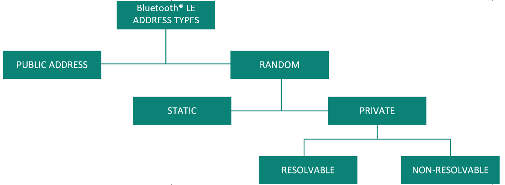
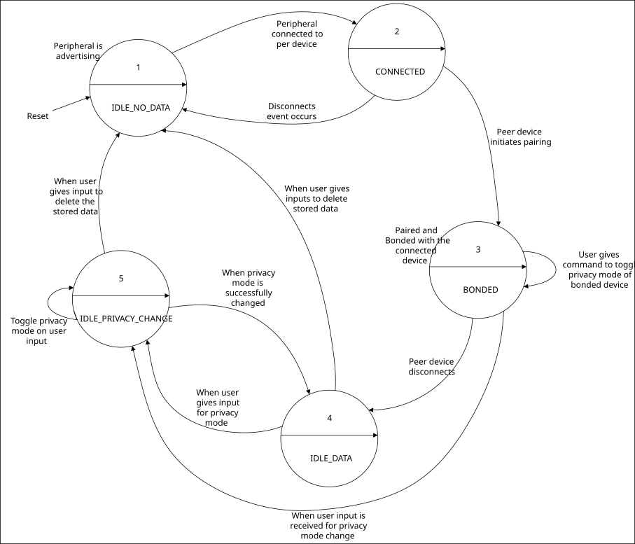
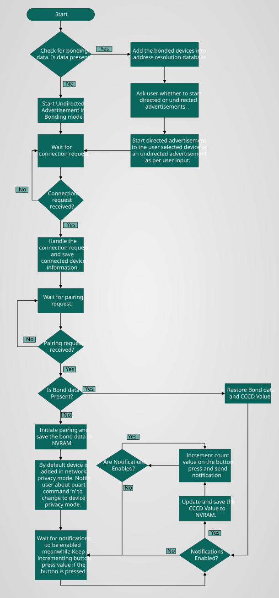

[Click here](../README.md) to view the README.

## Design and implementation

The design of this application is minimalistic to get started with code examples on PSOC&trade; Edge MCU devices. All PSOC&trade; Edge E84 MCU applications have a dual-CPU three-project structure to develop code for the CM33 and CM55 cores. The CM33 core has two separate projects for the secure processing environment (SPE) and non-secure processing environment (NSPE). A project folder consists of various subfolders, each denoting a specific aspect of the project. The three project folders are as follows:

**Table 1. Application projects**

Project | Description
--------|------------------------
*proj_cm33_s* | Project for CM33 secure processing environment (SPE)
*proj_cm33_ns* | Project for CM33 non-secure processing environment (NSPE)
*proj_cm55* | CM55 project

> **Note:** For KIT_PSE84_HMI, a custom *design.modus* file is provided (under *templates* folder) as the PWM connection to the RGB LED is not enabled in the default BSP configuration.

 

In this code example, at device reset, the secure boot process starts from the ROM boot with the secure enclave (SE) as the root of trust (RoT). From the secure enclave, the boot flow is passed on to the system CPU subsystem where the secure CM33 application starts. After all necessary secure configurations, the flow is passed on to the non-secure CM33 application. Resource initialization for this example is performed by this CM33 non-secure project. It configures the system clocks, pins, clock to peripheral connections, and other platform resources. It then enables the CM55 core using the `Cy_SysEnableCM55()` function and the CM55 core is subsequently put to DeepSleep mode.

In the CM33 non-secure application, the clocks and system resources are initialized by the BSP initialization function. The retarget-io middleware is configured to use the debug UART. BTSTACK is initialized and callback functions are registered. Events handlers are written to handle the BTSTACK callback events.

The objective of the application is to demonstrate the privacy features available in the Bluetooth&reg; devices.

Bluetooth&reg; devices implement privacy mainly by using **different types of addresses**: 

- Public (no privacy) 

- Random: Random addresses can be Static (no periodical changes) or Private (periodical changes, offering privacy protection). Private addresses can be further divided into Non-resolvable or Resolvable

**Figure 1** shows the different Bluetooth&reg; LE address types.

**Figure 1. Bluetooth&reg; LE address types**

The use of **Resolvable Private Addresses (RPA)** allows only the devices that are paired to your device to *identify* the device as a known device; all other devices will perceive the device as a new device, making it difficult to track.

If the device uses non-resolvable private address, it will be perceived as a new device every time it changes its address. The address is changed at regular intervals and is configurable.

Every privacy-enabled Bluetooth&reg; LE device has a unique address called the **Identity Address** and an **Identity Resolving Key (IRK)**. The Identity Address is the Public Address or Static Address of the Bluetooth&reg; LE device. The IRK is used by the Bluetooth&reg; LE device to generate its RPA and is used by peer devices to resolve the RPA of the Bluetooth&reg; LE device. Both the Identity Address and the IRK are exchanged during the pairing process.

Privacy-enabled Bluetooth&reg; LE devices maintain a list that consists of the peer device’s Identity Address, the local IRK used by the Bluetooth&reg; LE device to generate its RPA, and the peer device’s IRK used to resolve the peer device’s RPA. This is called the **Resolving List**. Only peer devices that have the 128-bit IRK of a Bluetooth&reg; LE device can resolve the device's RPA. See **Table 3** for a logical representation of the Resolving List.

Bluetooth&reg; 5.0 introduces more options for privacy protection in the form of **privacy modes**. There are two modes of privacy: device privacy and network privacy.

- **device privacy:** In this mode, a device is only concerned about the privacy of the device and will accept advertising/connection packets from peer devices that contain their Identity Address and ones that contain a private address, even if the peer device has distributed its IRK in the past

-  **network privacy:** In this mode, a device will only accept advertising/connection packets from peer devices that contain private addresses. By default, the network privacy mode is used when private addresses are resolved and generated by the controller

When a device is trying to reconnect the controller checks the Resolving List. Based on the result, two cases can occur, they are as follows:
- Device is found in the list
- Device not found in the list

### Device is found in the list

**Table 1** shows the accepted and rejected combinations of advertisement and connection address types and their corresponding privacy modes.

**Table 1. Advertisement and connection address types**

Advertisement/connection address type| Privacy mode  |Request accepted/rejected
------------------------------------|---------------|-------------------------
Identity address                    | Network       | Rejected                
Identity address                    | Device        | Accepted                
Resolvable private address          | Network       | Accepted                
Resolvable private address          | Device        | Accepted                

 

### Device not found in the list

In this case, the incoming device is treated as a new device and the request is forwarded to the host by the controller for further processing.

> **Note:** A device using non-resolvable private address will be treated as a new device every time it reconnects and changes its address.

**Table 2** shows the logical representation of the resolving list.

**Table 2. Logical representation of resolving list entries**

Device|Local IRK | Peer IRK  | Peer identity address  |Address type  | Privacy mode    
------|----------|-----------|------------------------|--------------|-----------------
1     |Local IRK | Peer IRK 1| Peer identity address 1|Address type 1| Network/device 1
2     |Local IRK | Peer IRK 2| Peer identity address 2|Address type 2| Network/device 2
3     |Local IRK | Peer IRK 3| Peer identity address 3|Address type 3| Network/device 3

The application runs a custom button service with one custom characteristic that counts the number of button presses on the kit. It can be read or set up for notifications. The GATT DB is set up so that the characteristic can be read without pairing/bonding, but for enabling and disabling notifications pairing/bonding is required. Each time the button on the kit is pressed, the count value is incremented. If any device is connected and has notifications enabled, the updated value is sent to it. If no device is connected or notifications are disabled, a message informing the same is displayed.

The device can store bond data of up to four peer devices, after which the data of the oldest device is overwritten by the new incoming device. The incoming device is added in network privacy mode by default. The application supports UART-based commands, which can be used to issue privacy mode change for the incoming device.

The peripheral has five states:

- **IDLE_NO_DATA:** The device in this state is either waiting for the user input or advertising. No bond data is present in the NVRAM. Directed advertising option is disabled in this state

- **IDLE_DATA**: The device in this state is either waiting for the user input or advertising. Bond data is present in the NVRAM. Directed advertising option is available

- **IDLE_PRIVACY_CHANGE**: The device in this state is not advertising. The device enters this mode when a command requires to change the privacy mode of bonded devices is issued

- **CONNECTED**: In this state, the peripheral is connected to a peer device

- **BONDED**: The peripheral moves into this state once it has paired and bonded with the connected device and the peer bond information has been saved to NVRAM

**Figure 2. Transition between different states**

The LED 3 on the kit is used to represent the current advertising state of the device.

**Table 3** shows LED behavior for different advertising states.

**Table 3. LED behavior for advertising states**
Advertisement state           | LED state                       
------------------------------|---------------------------------
Advertisement ON (Undirected) | Slow Blinking led (Duty cycle = 30%)
Advertisement ON (Directed):  | Fast Blinking led (Duty cycle = 60%)
Advertisement OFF, Connected: | LED ON                          
Advertisement OFF, Timed out: | LED OFF                         

**Figure 3. Process flowchart**

 